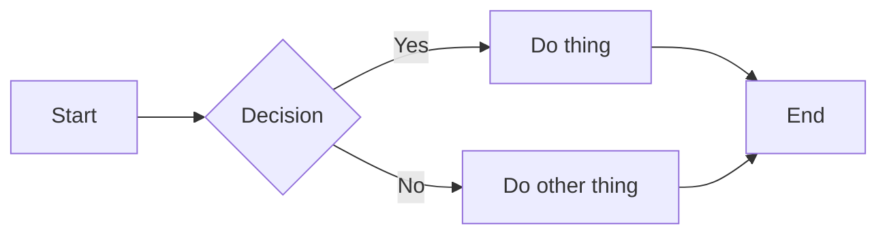

# Markdown Feature Showcase

## Headings

# H1

## H2

### H3

#### H4

##### H5

###### H6

## Text Emphasis

Plain text, **bold text**, *italic text*, ***bold italic***, ~~strikethrough~~, and `inline code`.

You can also use **bold** and *italic* with underscores, and combine ~~strikethrough with **bold**~~.

Superscript: X^2^ · Subscript: H~~2~~O (support varies by renderer)

## Blockquotes

> This is a simple blockquote.
> 
> It can span multiple paragraphs.
> 
> > Nested blockquotes are also possible.
> 
> — Attributed to *someone, somewhere*

## Lists

### Unordered

- Item one
- Item two
  - Nested item
  - Another nested item
    - Deeply nested
- Item three

### Ordered

1. First step
2. Second step
   1. Sub-step A
   2. Sub-step B
3. Third step

### Task Lists

- [x] Write the sample document
- [x] Include tables and code blocks
- [ ] Get feedback
- [ ] Ship it

## Links and Images

[Inline link](https://www.markdownguide.org) with a [link and title](https://www.markdownguide.org)

Reference-style link: [Bruno docs](https://docs.usebruno.com)

Autolink: [https://www.anthropic.com](https://www.anthropic.com)

Image with alt text:


## Code

Inline: use `git status` to check the working tree.

Fenced code block, no language:

```
plain text block
no syntax highlighting
```

Fenced code block with syntax highlighting:

```python
def fibonacci(n: int) -> int:
    a, b = 0, 1
    for _ in range(n):
        a, b = b, a + b
    return a

print(fibonacci(10))
```

```yaml
info:
  name: Create User
  type: http
  seq: 1
http:
  method: POST
  url: https://api.example.com/users
```

## Tables

| Feature | Supported | Notes |
| --- | --- | --- |
| Tables | ✅ | GitHub Flavored Markdown |
| Task lists | ✅ | `- [ ]` / `- [x]` |
| Footnotes | ✅ | See below |
| Left align | Left | :--- |
| Center align | Center | :---: |
| Right align | Right | ---: |

## Horizontal Rules

Three different syntaxes, all producing a horizontal rule:

---

---

---

## Footnotes

Here's a statement that needs a citation.\[^1\] And another one with a named reference.\[^note\]

\[^1\]: This is the first footnote. \[^note\]: This is a named footnote with more detail, and it can even contain `code` or **formatting**.

## Definition Lists

Markdown : A lightweight markup language for formatting plain text.

Bruno : An open-source, offline-first API client that stores collections as plain text files.

## Escaping and Special Characters

Use a backslash to show literal characters: \*not italic\*, # not a heading, \[not a link\].

## Line Breaks

This is the first line. This is a second line right after it (soft break).

This is a new paragraph after a blank line (hard break).

## Inline HTML

Markdown also allows raw HTML when the renderer supports it:

Click to expand

Hidden content revealed on click — useful for FAQs or optional detail.

Highlighted text and subscript / superscript via HTML tags.

## Math (LaTeX, if supported by the renderer)

Inline math: $E = mc^2$

Block math:

$$ \\sum\_{i=1}^{n} i = \\frac{n(n+1)}{2} $$

## Diagram (Mermaid, if supported by the renderer)



## Emoji

Shortcodes (renderer-dependent): :rocket: :tada: :warning: Unicode: 🚀 🎉 ⚠️

## Table of Contents (manual)

- [Headings](#headings)
- [Text Emphasis](#text-emphasis)
- [Blockquotes](#blockquotes)
- [Lists](#lists)
- [Links and Images](#links-and-images)
- [Code](#code)
- [Tables](#tables)
- [Footnotes](#footnotes)

---

*End of showcase document.*
